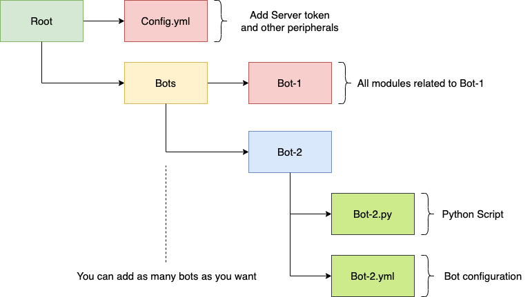

# 🤖 Sentinels 
👋 Welcome to sentinels!

> This repo hosts all the code related to applications & bots serving our Discord community.

## 📌Repo at a glance

<p align="center">
  
</p>

```
NimbleEdge/Sentinels
├── CONTRIBUTING.md           <-- Please go through the contributing guidelines before starting 🤓
├── README.md                 <-- You are here 📌
├── Docs                      <-- Documentation 📄
└── Bots                      <-- All the sentinels hang out here 🌝 
```

## 🦾🤖 Getting Started 

### ▶ Create conda environment 

Install conda and create environment

```
conda create -n <yourcondaenv>
```

### ▶ Install dependencies

```
conda activate <yourcondaenv>
pip install requirement.txt
```
### ▶ Add your server token to [Config.yml](https://github.com/NimbleEdge/Sentinels/blob/master/config/config.yml)

```yml
TOKEN: <replace your server token here>

```

### ▶ Start coding your bot 
```
cd Bots
mkdir <yourbotname>
```

# 🎯 Intersted in contributing?

1. Please read our [CONTRIBUTING](https://github.com/NimbleEdge/Sentinels/blob/master/CONTRIBUTING.md) guidelines.
2. Star, fork, and clone the repo.
4. Add your awesome features.
5. Push changes to your fork.
6. Submit a PR to NimbleEdge/Sentinels. 🎉

> 💬 For any queries on contributing, reach out to us on [Discord](https://nimbleedge.ai/discord) 
> 😎 Let's build cool things together!
