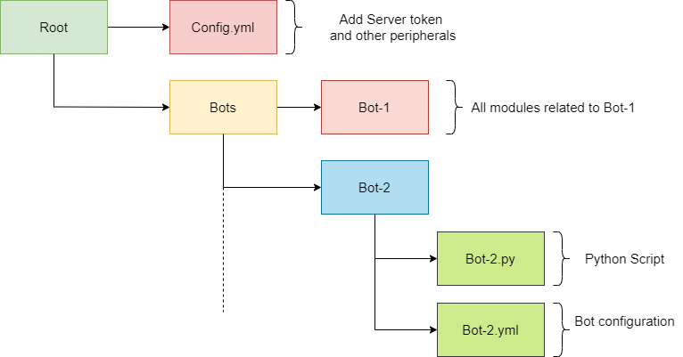

## Sentinals 🤖

Code related to any applications / bots serving our discord community.

## Repo structure



```
NimbleEdge/Sentianls
├── CONTRIBUTING.md           <-- Please go through the contributing guidelines before starting 🤓
├── README.md                 <-- You are here 📌
├── Docs                      <-- Documentations 📄
└── Bots                      <-- All the sentinals hang out here 🌝 
```

## Getting Started 🦾🤖

### Create conda environment 

Install conda and create environment

```
conda create -n <yourcondaenv>
```

### Install depedencies

```
conda activate <yourcondaenv>
pip install requirement.txt
```
### Add your server token to [Config.yml](https://github.com/NimbleEdge/Sentinels/blob/master/config/config.yml)

```yml
TOKEN: <replace your server token here>

```

### Start with your bot 🦾
```
cd Bots
mkdir <yourbotname>
```

